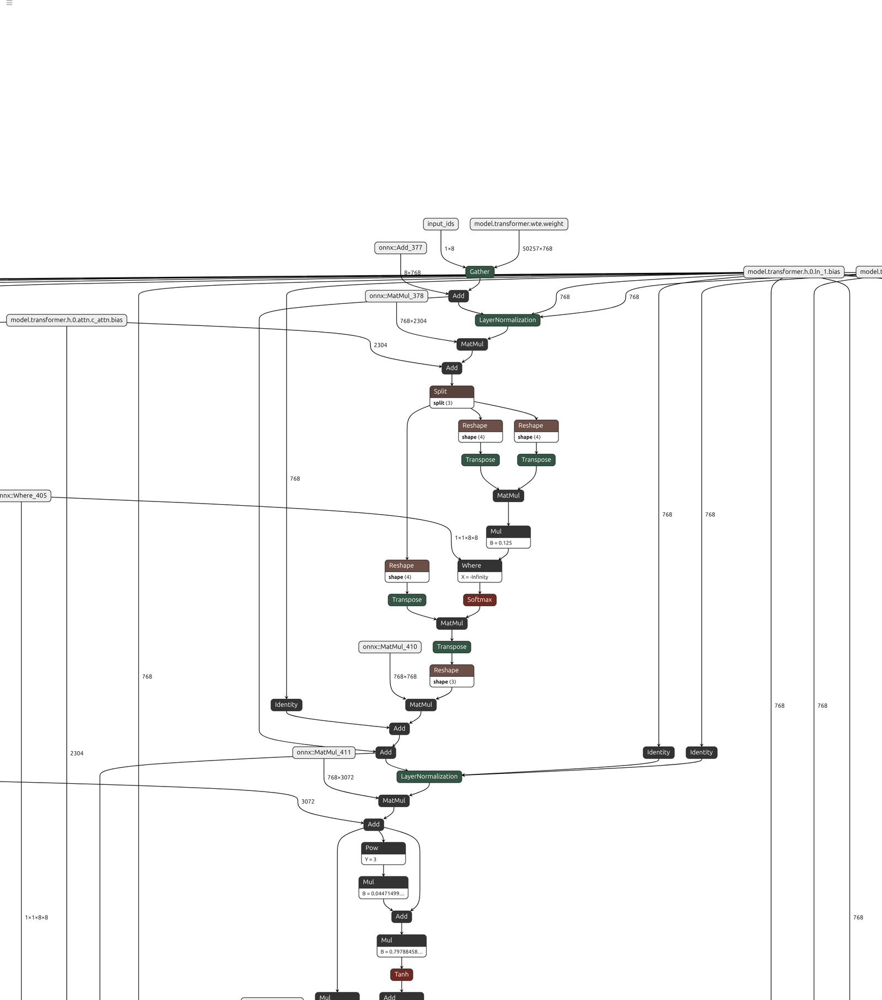
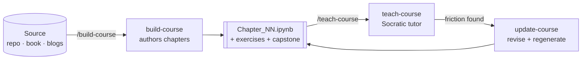

# claude-course-skills

> **Turn any GitHub repo, book, or PDF into a self-paced, hands-on course — then have an AI tutor teach it to you, one quiz at a time.**

Three composable [Claude Code](https://docs.anthropic.com/en/docs/claude-code) / [Agent Skills](https://www.anthropic.com/news/agent-skills) that build, teach, and maintain interactive **Jupyter-notebook courses** from source material you already have. Point them at a codebase like *nanoGPT*, a textbook like *Designing Data-Intensive Applications*, or a pile of blog posts — and get chapter-by-chapter learning notebooks with runnable code, figures, graded exercises, assignments, and a capstone. Then learn it actively, Socratic-style, instead of passively reading.

<p align="center">
  <a href="#-install"></a>
  <a href="LICENSE"></a>
  
  
</p>

---

## See it *think*, not just sit there

A static diagram tells you what a thing **is**. An animation shows you what **problem it solves** — and that's what makes a hard idea finally click. So `build-course` doesn't stop at figures: it can author **step-by-step animated explainers**, right inside a chapter.

Here's one it builds for a notoriously slippery idea — **PagedAttention**, the trick that lets [vLLM](https://arxiv.org/abs/2309.06180) serve LLMs ~2–4× faster. Press play — the whole KV-cache memory problem *and its fix*, in about 40 seconds:

<p align="center">
  <video src="https://github.com/HorHang/claude-course-skills/raw/main/examples/figures/pagedattention.mp4" poster="https://github.com/HorHang/claude-course-skills/raw/main/examples/figures/pagedattention_poster.png" controls muted playsinline width="820">
    
  </video>
  <br>
  <em>▶ <a href="https://github.com/HorHang/claude-course-skills/raw/main/examples/figures/pagedattention.mp4">Play the 38-second explainer</a> — rendered with <a href="https://github.com/3b1b/manim">manim</a></em>
</p>

**Problem → Idea → Mechanism → Payoff** — the four beats every good explainer needs, walking the paper's own running example (block size 4; logical blocks `0,1,2` → physical blocks `7,1,3`, a new block allocated only when the last one fills). It's [one Scene of code](examples/build_pagedattention_manim.py) rendered with [manim](https://github.com/3b1b/manim) — the engine behind 3Blue1Brown. manim is the *polish* path of build-course's animation tier; where it isn't installed, a chapter falls back to a pure-[matplotlib script](examples/build_pagedattention_animation.py) with zero extra dependencies. See the [interactive-visualization reference](skills/build-course/references/interactive-visualization.md).

And motion isn't just for memory layouts — it's how you teach **geometry you can't draw flat**. Here's a chapter on the [Muon optimizer](https://kellerjordan.github.io/posts/muon/) (the trick that trains GPT-style models ~2× faster than AdamW) answering *"why does orthogonalizing the update actually help training?"* — by dropping two optimizers into the **same 3D loss valley** and letting you watch them walk:

<p align="center">
  <video src="https://github.com/HorHang/claude-course-skills/raw/main/examples/figures/muon_loss_landscape.mp4" poster="https://github.com/HorHang/claude-course-skills/raw/main/examples/figures/muon_loss_landscape_poster.png" controls muted playsinline width="820">
    
  </video>
  <br>
  <em>▶ <a href="https://github.com/HorHang/claude-course-skills/raw/main/examples/figures/muon_loss_landscape.mp4">Play the descent</a> — a 3D <a href="https://github.com/3b1b/manim">manim</a> <code>Surface</code> walked step by step, the animated twin of the chapter's static contour</em>
</p>

Same start, same step budget: **SGD-momentum** (grey) burns its travel fighting the steep wall and stalls; **Muon** (orange) flows down the valley floor to a far lower loss. The static contour says *Muon wins*; the [3D walk](examples/build_muon_loss_landscape_manim.py) shows you **why** — turning "trust me, it's better" into "oh, *that's* what orthogonalization buys you."

And sometimes the thing to see isn't *motion* but **the whole machine at once.** When a chapter follows a real model, `build-course` can drop in the actual computational graph — exported to ONNX and rendered with [Netron](https://github.com/lutzroeder/netron). Here's GPT-2, exported straight from [karpathy/llm.c](https://github.com/karpathy/llm.c)'s own `train_gpt2.py`, showing one full transformer block — token embedding → `LayerNorm` → QKV projection → `Split` → scaled dot-product attention (`MatMul` → ×1/√d → causal `Where` mask → `Softmax`) → output projection + residual → `LayerNorm` → the GELU MLP:

<p align="center">
  <a href="examples/figures/gpt2_netron.png">
    
  </a>
  <br>
  <em>One transformer block of GPT-2, the real forward graph from <a href="https://github.com/karpathy/llm.c">llm.c</a> — generated by <a href="examples/build_gpt2_netron.py">build_gpt2_netron.py</a>. Open the exported <code>gpt2.onnx</code> in <a href="https://netron.app">netron.app</a> to pan the full 12-layer model yourself.</em>
</p>

A static diagram of attention is someone's *drawing* of it; this is the **graph the code actually runs** — every `MatMul`, mask, and residual edge, with no hand-waving between the math and the model.

> 💡 If this is the kind of thing you wish every paper shipped with, **star the repo** ⭐ — then point it at a paper or codebase *you're* trying to learn.

---

## Why this exists

Most "learning" is passive: you open a book on one screen, a repo on another, a blog on a third, and bounce between them. You read, nod, and forget. **These skills replace that with active, hands-on learning in one place** — a notebook per chapter that puts the concept, a diagram, *runnable* code, and a quiz side by side, plus an AI tutor that refuses to let you just read.

| Without | With `claude-course-skills` |
|---------|------------------------------|
| Read docs → context-switch → forget | One notebook per chapter: concept → figure → runnable code → exercise |
| "I think I understand this" | A tutor that quizzes you and corrects your answer |
| Conceptual books with no code to run | A runnable **simulation** of every concept |
| A course that's wrong or too hard, stuck that way | Regenerate the chapter from its build script in seconds |

## The loop



- **`build-course`** — authors the textbook. Ingests your source, asks who's learning (fresh student → senior engineer), proposes a chapter outline, then generates one notebook per chapter.
- **`teach-course`** — runs the classroom. Teaches one idea, quizzes you, **stops and waits** for your answer, then corrects it. No walls of text.
- **`update-course`** — keeps it alive. When teaching reveals a chapter is too hard, wrong, or missing an example, it edits the build script and regenerates the notebook.

## What a generated chapter contains

- **Concept arc per idea:** motivate → define → diagram → the naive gap → runnable code → interpret.
- **Runnable everything.** Python by default, but also CUDA/C++, SQL, Bash, or a from-scratch **concept-simulation** for prose-only books (e.g. simulate leader/follower replication lag from *DDIA*).
- **Mermaid diagrams** that render in JupyterLab, VS Code, GitHub, and nbviewer — not garbled matplotlib boxes.
- **Animated & interactive explainers** when motion teaches better than a still frame (a gradient path, an algorithm stepping, a memory layout filling) — rendered on the matplotlib-only floor and degrading gracefully when a richer engine is absent. See the [PagedAttention animation above](#see-it-think-not-just-sit-there).
- **3–5 inline exercises** per chapter with **collapsible solutions** (hidden by default, click to reveal).
- **Course-level assignments** released at each 20% milestone, plus **one capstone final project**.
- **Persona-tuned depth** — vocabulary, math rigor, figure density, and difficulty all scale to the learner.
- **Reproducible by design:** every notebook is generated from a `build_<chapter>.py` script (the source of truth), so chapters are diffable, regenerable, and consistent. You never hand-edit `.ipynb` JSON.

## See a real generated chapter

Don't take our word for it — [**`examples/Chapter_01_Quorum_Consistency.ipynb`**](examples/Chapter_01_Quorum_Consistency.ipynb) is a real chapter this skill generated and verified (GitHub renders it inline). It turns a prose-only idea from *Designing Data-Intensive Applications* — the `w + r > n` quorum rule — into something you **run, break, and measure**, for a graduate-level learner:

- a **Mermaid diagram** of the client→replica write/read paths,
- a **concept-simulation** (brute-force overlap check + Monte-Carlo stale-read estimate that matches the closed form),
- a **data plot** showing stale reads vanish once `w + r > n`,
- **3 exercises** with collapsible, self-checking solutions.

<p align="center">
   n" src="examples/figures/fig_01_stale_read.png" width="560">
</p>

The whole chapter is built from one script — [`examples/build_01_quorum_consistency.py`](examples/build_01_quorum_consistency.py) — and passes the bundled reviewer with **0 errors, 0 warnings**.

There's a second example for the **repo → course** path: [**`examples/Chapter_02_BPE_Tokenizer.ipynb`**](examples/Chapter_02_BPE_Tokenizer.ipynb) follows a real codebase — Karpathy's [minbpe](https://github.com/karpathy/minbpe) — function by function, re-implementing Byte Pair Encoding with **"translation bridge"** cells that map each concept back to its source file. See [examples/](examples/) to reproduce both in a few commands.

## 🚀 Install

This repo is a **Claude Code plugin marketplace** — install it the standard way, or copy the skills in manually.

### Claude Code — as a plugin (recommended)

In Claude Code, run:

```
/plugin marketplace add HorHang/claude-course-skills
/plugin install course-skills@claude-course-skills
```

That installs all three skills as one plugin; `/build-course`, `/teach-course`, and `/update-course` are available immediately (and update with `/plugin update course-skills`). Browse or toggle it anytime from the `/plugin` menu.

### Claude Code — manual copy

Prefer not to use the plugin system? Drop the skill folders into your skills directory:

```bash
git clone https://github.com/HorHang/claude-course-skills.git
cp -r claude-course-skills/skills/* ~/.claude/skills/
```

> **Project-scoped instead?** Copy into `.claude/skills/` inside a repo to share the skills with your team via version control.

### Other hosts (Cursor, Codex, Copilot CLI, Gemini CLI)

Agent Skills are portable. Copy the same `skills/*` folders into your host's skills directory. `teach-course` and `update-course` require no extra packages; `build-course` needs **Python 3.11+** and `matplotlib` (plus `nvcc` only for CUDA chapters).

## Quick start

**1. Build a course from a repo or book:**

```
/build-course turn https://github.com/karpathy/nanoGPT into a course for a graduate student
```

Claude reads the source, asks which source is primary and who's learning, proposes a chapter outline for your buy-in, then generates verified notebooks.

**2. Get taught a chapter:**

```
/teach-course teach me Chapter_03_Attention.ipynb
```

It shows a roadmap, teaches one concept, quizzes you — and waits.

**3. Fix a chapter that isn't landing:**

```
/update-course Chapter_03 is too abstract — add a concrete worked example for attention scores
```

It edits the build script, regenerates the notebook, and re-runs the reviewer.

## Worked examples

| Source | Becomes |
|--------|---------|
| **A code repo** (nanoGPT, a framework you maintain) | Chapters that follow the modules, with "translation bridge" cells mapping each concept to `path:line` in the real code |
| **A conceptual book** (*Designing Data-Intensive Applications*, *Statistical Rethinking*) | Chapters with a runnable **simulation** per idea — quorums calculator, consistent-hashing ring, Bayesian grid approximation |
| **A reference impl in another language** (a Go project, learner wants Python) | A faithful port, with the original kept as a bridge and its tests reused as the exercise checks |
| **A query/DSL** (SQL, Cypher, SPARQL) | The language taught **verbatim** and run for real (sqlite/DuckDB, rdflib), never paraphrased into Python |

## How it works (design principles)

1. **The build script is the source of truth.** `build_<ch>.py` emits the `.ipynb`. Edits go to the script; the notebook is a build artifact. This makes courses regenerable and reviewable.
2. **Ground every claim.** Skills web-search and cite source-of-truth facts instead of asserting from memory.
3. **Prefer a runnable simulation over a static diagram** whenever a concept can be made interactive.
4. **Understanding is proven by answering, not by explaining.** The tutor stops after every question.
5. **Verify before shipping.** A reviewer script executes every code cell *and* extracts each collapsible solution to check it against its exercise's asserts, then flags render-breakers (missing images, unbalanced `$`, broken `<details>`).

## Documentation

- [docs/build-course.md](docs/build-course.md) — author courses from a source
- [docs/teach-course.md](docs/teach-course.md) — the Socratic tutoring loop
- [docs/update-course.md](docs/update-course.md) — revise and regenerate chapters
- [docs/installation.md](docs/installation.md) — install across hosts, requirements, troubleshooting
- [docs/faq.md](docs/faq.md) — common questions

## Requirements

| Skill | Needs |
|-------|-------|
| `build-course` | Python 3.11+, `matplotlib`; `nvcc` (NVIDIA CUDA toolkit) only for CUDA chapters |
| `teach-course` | Nothing beyond the agent host — reads `.ipynb` JSON |
| `update-course` | Python 3.11+ and the chapter's `build_<ch>.py` |

Notebook verification uses `subprocess`, not Jupyter/nbconvert, so it runs anywhere Python does.

## Contributing

Issues and PRs welcome — see [CONTRIBUTING.md](CONTRIBUTING.md). Good first contributions: new runner profiles (Rust, Go, R, Julia), new learner personas, and example courses built from public sources.

If these skills helped you learn something, **please star the repo** ⭐ — it's the signal that tells other learners this exists.

## License

[MIT](LICENSE) © claude-course-skills contributors

---

<sub>Keywords: Claude Code skills, Agent Skills, AI course generator, turn GitHub repo into course, learn a codebase, interactive Jupyter notebook course, AI tutor, Socratic tutoring, self-paced learning, build a course from a book/PDF, concept simulation, data science course generator, machine learning curriculum, CUDA / SQL / Python learning notebooks.</sub>
