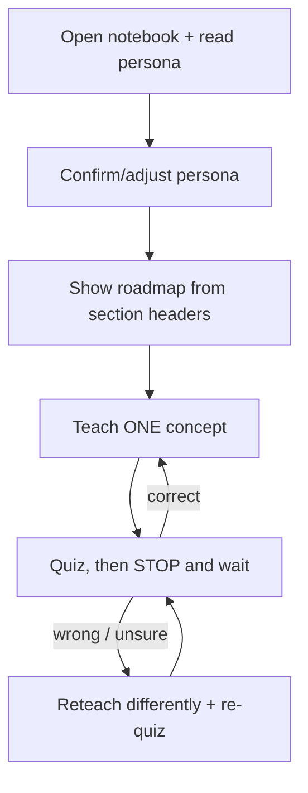

# teach-course — an AI tutor that quizzes you through a notebook

`teach-course` is the **delivery** skill. It takes a chapter notebook (built by [build-course](build-course.md) or any `Chapter_*.ipynb`) and teaches it to you like a classroom teacher: one idea at a time, with a quiz after each — and it **stops and waits** for your answer instead of dumping a wall of text.

> Triggers: `/teach-course`, "teach me this notebook", "quiz me on chapter", "tutor me through", "be my teacher for".

## The Iron Rule

**After it asks a quiz question, it stops and waits for your real answer.** It never answers its own question, and never teaches the next concept in the same turn as the quiz. Understanding is proven by *you answering*, not by it explaining.

## The teaching loop

1. **Open the notebook & read the persona** from its front matter (`> Audience: ...`) plus the recorded content and code languages. It teaches in that language and at that depth.
2. **Confirm or adjust** the persona, goal, and explanation language. You can switch any of them.
3. **Show the roadmap** — chapter sections as ✅ done / 👉 current / ⏳ next. You pick where to start.
4. **Teach one concept** — a few sentences at your level, pointing at the chapter's figure and code.
5. **Quiz** — 1–2 *thinking* questions: predict the output, "why this line?", "what breaks if…", or the section's own embedded exercise (without revealing its solution). Then it stops.
6. **Evaluate** — it affirms what's right, pinpoints what's wrong, and gives the correction *and the why*. Only then does it advance. Wrong or unsure → it reteaches differently and re-quizzes the same idea.

## How a notebook maps to a lesson

| Notebook element | Teaching use |
|------------------|--------------|
| `> Audience: **<persona>**` | Question difficulty and explanation depth |
| `## N. <Concept>` headers | The lesson roadmap |
| Concept markdown + figure | The "explain one concept" material |
| Runnable code cell | "Predict the output" / "why this line?" quizzes |
| `## Exercise N` + collapsible solution | Ready-made quizzes (solution withheld until you attempt) |

## When the chapter itself is the problem

If you stall on the same concept after a reteach, keep asking for an example the chapter doesn't have, or hit a confusing/broken cell — the friction is the *course*, not you. `teach-course` names the specific concept and what's missing, then recommends running [update-course](update-course.md) on that chapter. It won't hand-patch the notebook mid-lesson.

## Requirements

Nothing beyond your agent host — it reads the `.ipynb` JSON directly. Portable across Claude Code, Cursor, Codex, Copilot CLI, and Gemini CLI.

## See also

- [build-course](build-course.md) — author the notebooks first.
- [update-course](update-course.md) — fix a chapter teaching revealed is weak.
- The full skill spec: [`skills/teach-course/SKILL.md`](../skills/teach-course/SKILL.md).
