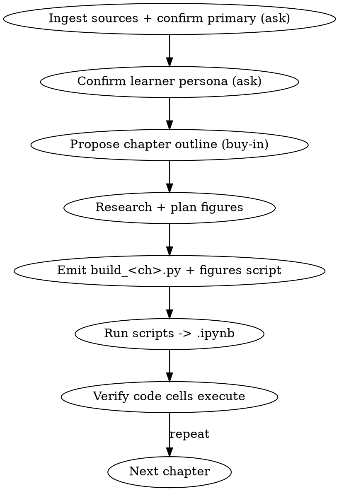

# Build Course

## Overview

Turn dense source material into **self-paced learning notebooks** — one notebook per chapter that puts the concept, a mental-map figure, runnable code (or a runnable simulation), graded exercises, assignments, and a capstone **in one place**. This replaces passive reading + PC↔book↔blog context-switching with active, hands-on learning.

**Core principle:** the notebook is *generated from a build script*, never hand-written. You author `build_<ch>.py` (the source of truth); running it emits the `.ipynb`. This makes chapters diffable, regenerable, and consistent.

**Companion skill:** after building, `teach-course` tutors a learner *through* a generated notebook. Build authors the textbook; teach runs the classroom.

## When to Use

- User points at a GitHub repo, a book/PDF, or a list of blog posts and wants to *learn* it deeply, not just read it.
- "Make a course / curriculum / notebook chapter from <source>."
- The source is conceptual (e.g. *Designing Data-Intensive Applications*) and lacks hands-on practice — a key case (see runner-profiles concept-simulation).

**When NOT to use:** the user wants a quick explanation or a one-off script — just answer or do it. Use `teach-course` (not this) to *deliver* an already-built notebook interactively.

## Workflow



### 1. Ingest sources & confirm which is PRIMARY (AskUserQuestion)
Read each source: repo (Glob/Grep/Read or GitHub MCP), PDF/book (Read with `pages`), blogs (WebFetch/WebSearch). Then ask which source is **primary**, because it sets the chapter skeleton:
- **Repo-primary** — codebase is the spine; chapters follow its modules/components; book/blogs assist. Outline ≈ repo structure.
- **Book-primary** — book is the spine; chapters follow its table of contents; repo (often none) + blogs assist with code/examples. Outline ≈ book ToC.

Also at this stage: if the source ships **multiple languages** (parallel `content/<lang>/` dirs or an `i18n/` folder), AskUserQuestion which language to read (prefer the fullest copy). If **multiple sources cover the same material** (full text + notes + a code repo), don't pick one — **align them per chapter** (depth text / recap / hands-on code). If a source already has **chapter-structured markdown with figures**, plan to ADOPT it, not rewrite it.

Details and ingestion recipes: see references/source-ingestion.md.

### 2. Confirm learner persona + languages (AskUserQuestion) — REQUIRED, drives all adaptation
Do this before drafting. Ask the learner to pick: **fresh student / graduate / PhD-researcher / entry-level practitioner / senior engineer**, plus depth and chapter granularity. Also ask the **preferred code language** for hands-on cells (e.g. Python / TypeScript / JavaScript / the source's own language); when the source's reference code is in another language (e.g. Go), port it via the "port reference implementation" profile (references/runner-profiles.md). This generic code-language choice applies to implementation code only — it does NOT override a **subject language** the chapter teaches (SQL / Cypher / SPARQL / a DSL), which stays verbatim. The persona sets vocabulary, math depth, pacing, figure density, exercise difficulty, and capstone scope. **Record the persona, the content language, and the code language in chapter front matter** (so regeneration and `teach-course` stay consistent). Map persona → concrete knobs via references/learner-personas.md.

### 3. Propose a chapter outline (buy-in)
Present an ordered list of main chapters, each with objectives + prerequisites. Keep it to one screen. Get a thumbs-up or let them pick a starting chapter.

### 4. Research & ground each chapter
WebSearch/WebFetch to confirm source-of-truth claims and gather citations. Plan one visual per major concept, and **pick its medium**: matplotlib PNG only for quantitative *data plots*; **Mermaid (preferred) for any diagram** — flows, architectures, graphs/DAGs, ER, state machines, taxonomies — falling back to a markdown table or ASCII only when Mermaid doesn't fit or the host can't render it (see references/notebook-blueprint.md "Visualization decision"). Hand-placed matplotlib boxes overlap and render as garbage. Never assert technical facts from memory — ground them. When a concept is better felt through **motion or interactivity** (a math transform, a gradient path, a loss surface, a network's architecture, attention), plan an **interactive-viz** instead of a still image — see references/interactive-visualization.md (catalog, decision matrix, degradation-safe recipes). Use it only when motion teaches.

### 5. Generate each chapter (emit + run a build script — never hand-write .ipynb JSON)
- Copy assets/build-script-template.py → `<course>/build_<ch>.py`; fill cells along the arc in references/notebook-blueprint.md.
- If a source already has **chapter-structured markdown**, adopt it as the spine: reuse its sections and existing figures, then add runnable cells, exercises, and translation bridges on top (do NOT rewrite good prose). See references/notebook-blueprint.md "Adopt existing chapter markdown".
- Copy assets/figures-template.py → `<course>/build_<ch>_figures.py`; draw that chapter's diagrams (skip for figures you reuse from the source).
- Pick the **runner profile** matching the domain (references/runner-profiles.md): CUDA, Python, Bash, SQL, **concept-simulation** for prose topics, or **port-reference-implementation** when translating existing code (e.g. Go) into the learner's chosen language.
- If the chapter's SUBJECT is a query/markup/DSL language (SQL, Cypher, SPARQL, regex…), **keep it verbatim and run it for real** — do NOT translate it to Python; add a Python cell only as a labelled mapping aid (references/runner-profiles.md "Specialized / domain language").
- If a concept needs infra the learner's machine lacks (cluster, Spark, GPUs), **simulate it on one machine** for the aha AND add a **"Going to production" cell** stating the real setup (references/notebook-blueprint.md "Scaling ceiling").
- Embed **3-5 exercises** inline, each with a **collapsible solution** (use the `solution()` helper — emits a markdown `<details>` block that is collapsed by default and toggles open in VS Code and Jupyter; do NOT use `source_hidden`, VS Code ignores it). Do NOT put assignments or a capstone inside a chapter.
- For interactive/animated concepts, use the **animation / interactive-viz** runner profile and the figure helpers `animate_to_gif` / `loss_surface` (figures script) and `interactive_callout` (build script). Every rich cell must be try-rich/except-static so it degrades to a PNG/text on a bare machine — the reviewer warns on an unguarded `manim`/`plotly`/`netron`/`torchview`/`torchinfo` import.
- Run `python <course>/build_<ch>_figures.py` then `python <course>/build_<ch>.py` → emits `Chapter_<ch>_<Title>.ipynb`.

### 6. Course-level assignments & final project (NOT per chapter)
The course has **~5 assignments total**, released at each **20% progress milestone** as their own explicit notebooks (`Assignment_<k>_<topic>.ipynb`), each cumulative over the chapters so far. After the last chapter, emit **1 final project** notebook (`Final_Project_<title>.ipynb`). With `N` chapters, release assignment `k` after chapter `ceil(k*N/5)`. See references/assignments-rubric.md.

### 7. Review & verify (do NOT ship unreviewed)
Run the **notebook reviewer** (copy assets/review-notebook.py → `<course>/review-notebook.py`):
```
python <course>/review-notebook.py <course>/Chapter_<ch>_<Title>.ipynb
```
It executes every **Python** code cell in a shared namespace (skipping CUDA/C++/shell/magic cells — `%%writefile x.cu`, `!nvcc …`, `%%bash` — which are not Python and would otherwise raise false-positive `SyntaxError`s) and — because solutions live in markdown `<details>` and are otherwise never run — **extracts each solution and checks it against its exercise's asserts**. It also flags render-breakers: missing images, malformed `<details>`, unbalanced `$`, mermaid blocks (which some hosts show as raw text/an error), and over-long cells. Fix every ERROR by editing `build_<ch>.py` and re-running — never hand-edit the .ipynb.
Then do the **qualitative pass** the script cannot: fidelity to the source/book (every claim cited) and reading-flow / "aha" progression. See references/notebook-review.md.

## Quick Reference

| Phase | You do | Then |
|-------|--------|------|
| Ingest | Read sources, ask which is primary | Outline follows primary |
| Persona | Ask level (fresh→senior) | Record in front matter |
| Outline | Propose chapters w/ objectives | Get buy-in |
| Research | WebSearch/Fetch, plan figures | Ground every claim |
| Generate | Emit + run build_<ch>.py | One .ipynb per chapter |
| Verify | Run cells via subprocess | Fix failures |

## Common Mistakes

| Mistake | Fix |
|---------|-----|
| Hand-editing the `.ipynb` | Edit `build_<ch>.py` and re-run; the script is the source of truth. |
| One giant wall-of-text cell | Follow the per-concept arc (notebook-blueprint.md): concept → figure → code → exercise. |
| Solution shown as an open code cell | Use the collapsible `solution()` helper — hidden by default with a show/hide toggle. |
| Concept map drawn in matplotlib (boxes overlap → garbage) | matplotlib is for DATA plots only; use a markdown table / Mermaid / ASCII for concept maps & flows. |
| Figure referenced but never generated | Add it to `build_<ch>_figures.py`; verify the PNG exists. |
| ~5 assignments + capstone inside every chapter | Assignments are course-level: ~5 total at 20% milestones; 1 final project after the course. |
| Transcribing prose verbatim for conceptual books | Synthesize a runnable simulation (concept-simulation profile). |
| Hardcoding absolute paths | Use the template's configurable `OUTPUT_DIR` (CWD-relative). |
| Skipping the persona question | It is REQUIRED — depth/difficulty depend on it. |
| Picking a source language at random in a multi-language repo | Detect parallel `content/<lang>/` dirs and ask; prefer the fullest copy. |
| Regenerating prose when the source already has good chapter markdown | Adopt it as the spine and build on top; reuse its figures. |
| Re-implementing reference code from scratch in the wrong language | Use the port-reference-implementation profile; keep the original as a bridge and reuse its tests. |
| Shipping a chapter without running the reviewer | Run `review-notebook.py`; solutions in `<details>` are never executed otherwise, so a wrong solution ships silently. |
| Replacing a diagram with ASCII/markdown when Mermaid fits | Prefer Mermaid for diagrams (renders in JupyterLab/VS Code/GitHub); use ASCII/table only when Mermaid doesn't fit or the host can't render it. |
| Translating a subject language (SQL/Cypher/SPARQL) into Python | Keep the specialized language verbatim and run it for real; add a Python cell only as a labelled mapping aid. |
| Hands-on that needs a cluster/prod infra with no escape hatch | Simulate on one machine + add a "Going to production" setup cell. |
| Unguarded `import manim/plotly/netron` (crashes on a bare machine) | Wrap rich viz try-rich/except-static; degrade to a PNG/text. The reviewer warns on unguarded imports. |
| Animating a static fact for decoration | Animate only when a variable changes over time/step/parameter; otherwise a still plot or Mermaid. |
| `MathTex`/`Tex`/`Brace.get_text` in a manim scene (crashes `FileNotFoundError: 'latex'` on a LaTeX-free box) | Use `Text` (Pango) with Unicode/ASCII math (`Ψ`, `→`, `avg = (g0+g1)/N`); label braces with `Text(...).next_to(brace, DOWN)`. |
| Hardcoding a manim box width so it doesn't cover its label (text spills out) | Size the box from the text: `SurroundingRectangle(label)` / `BackgroundRectangle(label)`, never a literal width. |
| Rendering manim at `-qh` before verifying the scene | Smoke-render `-ql`, extract frames, inspect (overlap + every glyph), *then* `-qh`. |
| Embedding a video with only `<video>` (blank on GitHub, which strips it) | Add a fallback `[link](videos/…mp4)` + a `poster=` thumbnail; commit only `.py`+`.mp4`+`.png`, drop `media/`/`__pycache__`. |

## Red Flags — STOP

- About to write `.ipynb` JSON by hand → write/extend the build script instead.
- Drafting chapters before asking persona + primary source → ask first.
- Stating a technical fact you didn't verify → WebSearch/Fetch and cite.
- A conceptual chapter with zero runnable cells → add a concept-simulation.
- About to ship a chapter you didn't run `review-notebook.py` against → review first; unrun `<details>` solutions and unrendered mermaid hide there.
