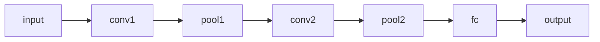

# Interactive & Animated Visualization

The fourth visualization tier for `build-course`: animation, loss landscapes, architecture graphs, and interactive explainers for ML/DL concepts that a still frame under-teaches.

## 1. Principle — the graceful-degradation contract

Every rich viz cell is authored **try-rich / except-static**:

1. Attempt the rich path (a manim/`matplotlib.animation` render, a plotly 3D surface, real model introspection).
2. On **any** missing dependency (no `ffmpeg`/LaTeX/GPU/`manim`/`plotly`/`netron`), fall back to a **static matplotlib PNG or text summary** and `print` a one-line `NOTE`.

Consequences: the dependency floor stays at `matplotlib`, the bundled `review-notebook.py` runs every cell clean on a bare machine, and a chapter never hard-fails on a visualization. Tools that cannot embed at all (standalone web apps) are **honest link-outs** — a cited callout plus a small local reproduction — never faked as "running locally".

## 2. Tiers

Each tool is tagged by how it integrates:

- **`embed`** — runs in-notebook and renders inline (always with a static fallback).
- **`launch`** — a cell starts a local server / opens a browser (e.g. `netron.start`), guarded by try/except; degrades to a static summary.
- **`link-out`** — a cited callout to a hosted interactive demo plus a small local reproduction of the same idea.

## 3. When to use (decision matrix)

| Concept being taught | Reach for | Fallback |
|---|---|---|
| A math transform / iterative algorithm / gradient path (motion teaches) | `animate_to_gif(frame_fn, ...)` (manim optional for polish) | static filmstrip PNG |
| Optimization geometry / sharp-vs-flat minima | `loss_surface(loss_fn, ...)` (plotly interactive) | static 3D PNG |
| Optimizer *path* / why-one-beats-another (the walk matters) | manim 3D `Surface` + dots walking on it (recipe below) | the static `loss_surface` PNG |
| Network architecture / layer shapes | `netron.start(model_file)` | `torchinfo.summary(model)` text → Mermaid `graph LR` |
| Attention / transformer internals | `interactive_callout("Transformer Explainer", ...)` + toy attention heatmap | matplotlib heatmap |
| Model interpretability / saliency / embeddings | `interactive_callout("LIT" / "What-If Tool", ...)` | matplotlib saliency / embedding scatter |
| CNN feature maps, GANs, playground intuition | matching `interactive_callout(...)` from the catalog | local matplotlib reproduction |

## 4. When NOT to animate

Motion must encode a **variable changing** (time / step / parameter). Otherwise a labelled still frame is the right call.

- Don't animate static facts, tables, or anything a labelled still frame shows as well.
- Never add a GIF for decoration — if nothing changes across frames, it's noise.
- Keep frames ≤ ~30 and fix seeds so the artifact is deterministic and diffable.
- If a Mermaid diagram or a single matplotlib plot teaches it, prefer that — it's lighter and renders everywhere.

## 5. Cell recipes

Each block is already degradation-safe. Copy it into `build_<ch>.py` (markdown/code helpers) or `build_<ch>_figures.py` (figure helpers).

**Animation** — draw frames with `animate_to_gif`, then reference the artifact from a markdown cell. The helper returns the actual path written (`.gif`, or a filmstrip `.png` fallback), so reference whichever extension it produced.

```python
def descent_frame(ax, i):
    ax.plot([0, 1], [0, i / 4.0])
    ax.set_ylim(0, 3)
    ax.set_title("gradient step")

out = animate_to_gif(descent_frame, n_frames=6, name="descent", fps=8)
print(f"reference figures/{out.name} from the markdown cell")
```

**Loss landscape** — `loss_surface` always writes the static `.png` the notebook embeds; the interactive `.html` is a bonus when plotly is installed.

```python
out = loss_surface(lambda a, b: a ** 2 + 0.5 * b ** 2, name="bowl", span=1.0, n=40)
print(f"notebook embeds figures/{out.name}; interactive .html is a bonus when plotly is present")
```

**3D loss landscape with an optimizer walk (manim polish)** — when the *path* matters as much as the surface (comparing optimizers, showing *why* one wins), animate dots walking **on** a 3D loss `Surface`. This is the polish tier over the static `loss_surface(...)` PNG above; keep that PNG as the fallback. A full, chapter-faithful reference is [`examples/build_muon_loss_landscape_manim.py`](../../../examples/build_muon_loss_landscape_manim.py) (`LossLandscapeWalkScene` — SGD-momentum vs Muon on an ill-conditioned valley). The three moves that keep it honest and cheap:

- **One height map for surface *and* dots.** Define `height(a, b)` once (e.g. normalized `log10(loss(a, b))` so a wide loss range stays legible), build the `Surface` from it, and place every step with `axes.c2p(nx(a), ny(b), height(a, b) + lift)`. Sharing the map glues the dots to the surface instead of floating above or sinking through it.
- **Subsample the trajectory** to ~25 points and animate one `self.play(dot.animate.move_to(pt), run_time≈0.15)` per step, with a `TracedPath(dot.get_center, ...)` drawing the descent. Keeps the render light and the motion crisp.
- **Reuse the static figure's math** — same seed, same projection plane (Li et al. PCA-of-trajectories), same optimizers — so the animation is a faithful *twin* of the committed PNG, not a second story that disagrees with it.

The overlap-safe layout rules below (title/caption bands, fixed-in-frame legends, QA-by-frame) apply unchanged to 3D scenes — a rotating camera makes a title/legend collision *more* likely, so check the first frame after rendering.

**Architecture (netron)** — the `launch` → `torchinfo` text → Mermaid chain. Try to open the interactive graph; on any failure print a `NOTE` and fall back to a text summary, then a hand-authored Mermaid diagram in the next markdown cell.

```python
try:
    import netron, torch  # optional
    torch.save(model, "model.pt")
    netron.start("model.pt")  # opens a browser
except Exception as e:
    print(f"NOTE netron/torch unavailable ({type(e).__name__}); text summary below")
    try:
        from torchinfo import summary
        summary(model, input_size=(1, 3, 32, 32))
    except Exception:
        print("Install torchinfo for a text summary; architecture diagram in the next cell.")
```

Then a markdown cell with a hand-authored Mermaid diagram of the layers:

````markdown

````

**Link-out tool** — emit a cited callout with `interactive_callout`; the learner opens the hosted demo, and a small local reproduction follows.

```python
cells.append(interactive_callout(
    name="Transformer Explainer",
    url="https://poloclub.github.io/transformer-explainer/",
    why="Watch live GPT-2 attention as it predicts the next token.",
    tier="link-out",
))
```

**manim scenes (polish tier)** — for a standalone explainer *video* rendered with [manim](https://github.com/3b1b/manim) (the 3Blue1Brown engine), the committed `.mp4`/`.gif` is what readers see, so manim + ffmpeg only need to exist on the machine that regenerates it. manim is the *polish* path; always keep a matplotlib fallback (above) for machines without it. See `examples/build_pagedattention_manim.py` for a full, paper-faithful reference scene.

**No LaTeX — use `Text` (Pango), never `MathTex`/`Tex`.** A box very often has **no LaTeX installed**, so `MathTex(...)`, `Tex(...)`, and `Brace.get_text(...)` all crash the render with `FileNotFoundError: 'latex'` — sometimes only partway through a long scene, after you've waited for it. Author every label with `Text(...)`, which uses Pango and needs no LaTeX. Write math with Unicode/ASCII glyphs in the string: `Ψ`, `→`, `≈`, `×`, `Σ`, `avg = (g0 + g1 + g2 + g3) / N`. For a labelled brace use `Text(...).next_to(brace, DOWN, buff=0.15)` instead of `brace.get_text(...)`. (Confirm Unicode glyphs like `Ψ` render in a frame before the final encode — see QA-by-frame below.)

**Overlap-safe layout — the rule that keeps generated scenes clean.** manim has no auto-layout, so the most common defect is **text colliding with text** — almost always a scene title overlapping the first content row. Prevent it structurally, never by eyeballing coordinates:

1. **Reserve bands.** The title owns the top band, the caption owns the bottom band. *Never* position content with an absolute upward shift (`.shift(UP * k)`) that reaches into the title's row — that is exactly what causes title/content overlap.
2. **Anchor, then chain.** Place the topmost content element *below the title* with `label.next_to(title, DOWN, buff=0.5)`, then chain each following row with `.next_to(previous, DOWN)`. Relative positioning cannot collide the way hand-tuned coordinates do.
3. **Fit to frame.** Clamp anything that might exceed the frame: `if m.width > 13: m.scale_to_fit_width(13)` for titles/captions, and `scale_to_fit_width(cell_w * 0.86)` for token text inside a cell.
4. **One title + one caption per scene**, each ≤ ~70 characters so they stay on a single line.
5. **Boxes wrap their text — never hardcode a box width.** A highlight/background box sized by a guessed width (`Rectangle(width=6.4)`) won't cover a label whose text is longer, so the text spills out both ends (the classic "the box doesn't cover the text" defect). Derive the box *from* the mobject: `SurroundingRectangle(label, buff=0.15)` or `BackgroundRectangle(label, buff=0.1)`. If you must use a plain `Rectangle`, set `rect.surround(label)` or `rect.match_width(label)` after creating the text, never a literal width.

**Flow: transform one persistent object, don't restart each scene.** Learners follow a concept far better when a single anchor mobject (e.g. a per-device memory bar) *persists and transforms in place* across scenes — replicate it, shard it, re-label it — rather than building a fresh, unrelated diagram per scene. When mirroring a paper, reuse the paper's own anchor figure (e.g. ZeRO Figure 1's params/grads/optimizer bar) so the animation reads as one continuous story instead of disconnected acts.

```python
def heading(text):
    t = Text(text, font_size=30, weight=BOLD)
    if t.width > 13:                       # never run past the frame edge
        t.scale_to_fit_width(13)
    return t.to_edge(UP, buff=0.45)        # title band

head = heading("The idea: page the cache into fixed-size blocks")
label = Text("Logical blocks").next_to(head, DOWN, buff=0.55)  # anchor BELOW the title
row2 = my_group.next_to(label, DOWN, buff=0.3)                 # chain downward
```

**QA by frame, not by faith — smoke-render cheap, inspect, then render final.** A title/content overlap (or a LaTeX/Unicode crash) is invisible in the source and a full-quality render is slow, so never spend a `-qh` render on an unverified scene. Render a **low-quality smoke pass first** (`-ql`), extract frames, and *look* — especially the first frame of every scene (where titles change) and any frame called out in feedback (e.g. "at 0:35 the box doesn't cover the text"):

```bash
manim -ql --format=mp4 build_<ch>_manim.py SceneName -o smoke   # fast draft
ffmpeg -i media/videos/build_<ch>_manim/480p15/smoke.mp4 -vf fps=2 frames/%03d.png
# inspect frames/*.png — confirm no text touches other text, every glyph rendered
manim -qh --format=mp4 build_<ch>_manim.py SceneName -o final    # only after it's clean
```

Open the frames and confirm no text touches other text. Only then encode the final `.mp4`/`.gif`. This frame check is the manim equivalent of running `review-notebook.py` — do not skip it.

**Embed the rendered video into a chapter.** The scene `.py` is the **source of truth** for the video, exactly as `build_<ch>.py` is for the notebook — regenerate the `.mp4` from it, never tweak the encoded file. Add the embed via a markdown cell in `build_<ch>.py` (not a hand-edit of the `.ipynb`):

```html
<video src="videos/<ch>_<topic>.mp4" controls width="720"
       poster="videos/<ch>_<topic>_thumbnail.png"></video>
```

- **Always add a fallback link** right after — **GitHub strips `<video>`**, so a reader there sees nothing: ``*If the player doesn't load, open [`videos/<ch>_<topic>.mp4`](videos/<ch>_<topic>.mp4) directly.*``
- **Generate a poster thumbnail** so the cell isn't blank before play: `ffmpeg -ss 7 -i videos/<ch>_<topic>.mp4 -frames:v 1 videos/<ch>_<topic>_thumbnail.png`.
- **Commit only the three stable artifacts** — the scene `.py`, the final `.mp4`, the poster `.png` — and delete manim's regenerable intermediates: `rm -rf videos/media videos/__pycache__`.
- Use relative, repo-rooted paths (`videos/...`), never absolute machine paths.

## 6. Tool catalog

Drop in the callout matching the concept being taught. Source: https://github.com/Machine-Learning-Tokyo/Interactive_Tools

| Tool | What it teaches | Tier | Topic tags | URL |
|---|---|---|---|---|
| Transformer Explainer | next-token GPT-2 internals | `link-out` | `transformers` | https://poloclub.github.io/transformer-explainer/ |
| exBERT | BERT attention/representations | `link-out` | `transformers,interpretability` | https://huggingface.co/exbert/ |
| BertViz | attention across BERT/GPT-2/etc | `embed` | `transformers,interpretability` | https://github.com/jessevig/bertviz |
| CNN Explainer | convnet layer-by-layer | `link-out` | `cnn` | https://poloclub.github.io/cnn-explainer/ |
| GAN Lab | GAN training dynamics | `link-out` | `gan` | https://poloclub.github.io/ganlab/ |
| ConvNet Playground | CNN semantic image search | `link-out` | `cnn` | https://convnetplayground.fastforwardlabs.com |
| Activation Atlases | learned feature atlases | `link-out` | `cnn,interpretability` | https://distill.pub/2019/activation-atlas/ |
| Visual Intro to ML | decision-tree/statistical learning intuition | `link-out` | `ml-basics` | http://www.r2d3.us/visual-intro-to-machine-learning-part-1/ |
| TensorFlow Playground | NN hyperparameter intuition | `link-out` | `ml-basics,nn` | https://playground.tensorflow.org/ |
| Neural Network Initialization | init effects | `link-out` | `nn,training` | https://www.deeplearning.ai/ai-notes/initialization/ |
| Embedding Projector | PCA/t-SNE/UMAP embeddings | `link-out` | `embeddings` | https://projector.tensorflow.org/ |
| OpenAI Microscope | neuron/layer vision-model viz | `link-out` | `cnn,interpretability` | https://microscope.openai.com/ |
| Atlas (Nomic) | large dataset exploration | `link-out` | `data` | https://atlas.nomic.ai/discover |
| Language Interpretability Tool (LIT) | NLP model behavior | `launch`/`link-out` | `interpretability,nlp` | https://pair-code.github.io/lit/ |
| What-If Tool | probe trained models | `launch`/`link-out` | `interpretability,fairness` | https://pair-code.github.io/what-if-tool/ |
| Measuring Diversity | bias in search/recsys | `link-out` | `fairness` | https://pair.withgoogle.com/explorables/measuring-diversity/ |
| Sage Interactions | algebra/calculus/crypto demos | `link-out` | `math` | https://wiki.sagemath.org/interact/ |
| Probability Distributions | distribution tour | `link-out` | `probability,math` | https://www.simonwardjones.co.uk/posts/probability_distributions/ |
| Bayesian Inference | coin-flip Bayes | `link-out` | `probability,math` | https://www.simonwardjones.co.uk/posts/bayesian_inference/ |
| Seeing Theory | visual probability & stats | `link-out` | `probability,math` | https://seeing-theory.brown.edu/ |
| Gaussian Process Visualization | GP & kernels | `link-out` | `probability,math` | http://www.infinitecuriosity.org/vizgp/ |
| manim | programmatic math animation | `embed` | `math,animation` | https://github.com/3b1b/manim |
| netron | model architecture graphs | `launch` | `architecture` | https://github.com/lutzroeder/netron |
| loss-landscape | NN loss surface viz | `embed` (reproduce) | `training,optimization` | https://github.com/tomgoldstein/loss-landscape |
