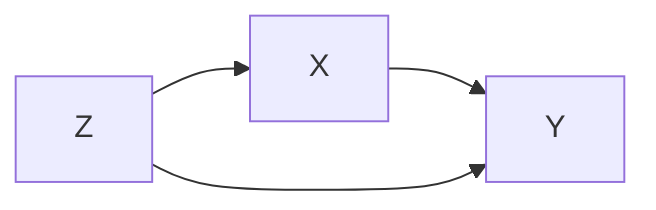

# Notebook Blueprint

The generalized cell sequence for a chapter, distilled from `Chapter_14a_GPU_Matmul_Deep_Dive.ipynb`. Works for a **main** chapter (not just a companion). Each numbered concept section follows the same arc. Build it in `build_<ch>.py` using `md()` and `code()` cells.

## Chapter cell sequence

1. **Front matter (md)** — title; one-line course/chapter context; **prerequisites**; an `> Audience: **<persona>**` line; a "What you'll learn" bullet list; the stakes ("why this matters").
2. **Concept sections (repeat per major idea)** — each section follows the arc below.
3. **Exercises (md + code)** — 3-5 inline, each: prompt + "predict before you run" + a **collapsible solution** (hidden by default; learner clicks to reveal).
4. **Further reading (md)** — categorized, cited links (source of truth / going deeper / references).
5. **Recap (md)** — summary bullets + teaser for the next chapter.

> **Assignments and the final project are NOT per chapter.** They are course-level: ~5 assignments total, released at each 20% progress milestone as their own explicit notebooks, plus 1 final project after the course completes. See assignments-rubric.md. A chapter contains only the concept arc + inline exercises.

## The per-concept arc (the heart of the design)

For each concept, emit cells in this order:

1. **Motivate** — why this concept exists / the problem it solves. Bold the key terms.
2. **Define + (math)** — the definition; formula if relevant (depth set by persona).
3. **Visual** — one mental-map visual per major concept. **Choose the right medium (see "Visualization decision" below):** a matplotlib PNG *only* for quantitative data plots; a markdown table / Mermaid / ASCII diagram for concept maps, taxonomies, lists, and flows. …or, when **motion or interactivity** teaches better than a still frame (a transform, a gradient-descent path, a loss surface, an architecture, attention), use the **interactive-viz tier** (references/interactive-visualization.md) — always with its static fallback.
4. **The gap / naive approach** — what a first attempt gets wrong (sets up the payoff).
5. **Runnable code or simulation** — the runner-profile cells: write → run → see output. Self-contained.
6. **Interpret** — explain the result the learner just saw.
7. (periodically) **Translation bridge** — map the concept to where it lives in the real source (repo `path:line`, or book section).

## Visualization decision (Mermaid-first for diagrams)

Pick the medium by what you are showing. **For any diagram, default to Mermaid** — it renders in JupyterLab, VS Code, GitHub, and nbviewer, looks far better than ASCII, and stays editable. Use matplotlib only for quantitative data plots.

| What you're showing | Use |
|---------------------|-----|
| Distribution, curve, scatter, benchmark, histogram (real numbers) | matplotlib PNG (`constrained_layout=True`) |
| **Motion or interactivity teaches it** — a transform, gradient path, loss surface, architecture, attention | **Interactive-viz tier** (`animate_to_gif` / `loss_surface` / `netron` / `interactive_callout`) — see references/interactive-visualization.md |
| **Any diagram** — flow, pipeline, architecture, graph/DAG, ER, state machine, taxonomy, concept map | **Mermaid fenced block (preferred)** |
| Comparing attributes across items (pure tabular data) | markdown table |
| Tiny inline hierarchy where Mermaid is overkill | ASCII code block (fallback only) |

**Never** hand-place boxes/arrows/text in matplotlib for a diagram — they collide and render as garbage. **Prefer Mermaid for diagrams;** fall back to a markdown table or ASCII only when Mermaid genuinely doesn't fit or the target host can't render it.

**Mermaid example (renders in Jupyter, VS Code, GitHub):**
```markdown

```

**Markdown table as a concept map (always crisp):**
```markdown
| Pre-made test (fragile) | Engineering principle (composable) |
|-------------------------|-------------------------------------|
| t-test, ANOVA, chi-square ... | Bayesian analysis, model comparison, multilevel models, causal DAGs |
```

**ASCII diagram for a small hierarchy:**
```markdown
    [ global memory ]   <- slow, large
          |
    [ shared memory ]   <- fast, per-block
          |
    [ registers ]       <- fastest, per-thread
```

## Teaching a specialized language (keep it verbatim)

When the chapter's SUBJECT is a specific language — SQL, Cypher, SPARQL, Datalog, GraphQL, regex, a config/DSL — **teach in that language; do NOT translate it into Python.** The specialized syntax IS the learning target, so the runnable cells must show and run it for real (SQL via sqlite/DuckDB, SPARQL via rdflib, etc. — see runner-profiles.md "Specialized / domain language"). You MAY add a generic-language cell (Python/TS) *alongside* that produces the same result, clearly labelled as a **mental-mapping bridge** — but the specialized language stays front and center. The learner's chosen generic code language (asked in Phase 2) applies only to general implementation code, never to the subject language.

## Scaling ceiling (when the learner's machine can't run it)

Some material targets big clusters, distributed systems, GPUs, or production infra the learner's laptop can't run (Kafka, Spark, a 5-node DB). Don't pretend it runs, and don't drop the hands-on. Do both:
- **Shrink it to a single-machine simulation** for the "aha" (concept-simulation profile) — e.g. simulate partitions/replicas/workers as threads or processes in one Python process.
- **Add a "Going to production" cell** stating the real setup to move ahead: the actual tools, the topology, rough resource needs, and how to provision it (managed service / docker-compose / k8s). This names the ceiling honestly and gives the learner a concrete next step instead of a toy that silently misrepresents production.

## Adopt existing chapter markdown (don't rewrite good prose)

When a source already provides chapter-structured markdown (e.g. `content/en/chN.md` with figures), do NOT regenerate it from scratch — **adopt and enhance**:

- Use the source's section headings as the concept-arc skeleton; keep its wording where it's already clear.
- **Reuse its existing figures** — copy/reference the source's image files rather than drawing new ones; only add a figure where one is missing (then follow the "Visualization decision" rules).
- Layer the active-learning parts ON TOP of the adopted prose: a runnable cell or simulation per concept, 3-5 exercises with collapsible solutions, and a translation bridge to the matching code (port it if it's in another language — see runner-profiles.md).
- If the source is in another language, translate the adopted prose into the chosen content language as you go; record source + output language in front matter.

This converts polished but passive reading material into a hands-on notebook with minimal rewriting.

## Minimal filled example (Python profile, one concept)

```python
cells.append(md(r"""## 2. Why vectorizing beats a Python loop

A NumPy vector op runs in compiled C over contiguous memory; a Python `for`
loop pays interpreter overhead **per element**. The gap grows with N.


"""))

cells.append(code(r"""import numpy as np, time
N = 2_000_000
x = np.random.rand(N)

t0 = time.perf_counter(); s1 = sum(v*v for v in x); t1 = time.perf_counter()
s2 = float(x @ x); t2 = time.perf_counter()

print(f"loop:       {t1-t0:.3f}s")
print(f"vectorized: {t2-t1:.4f}s  ({(t1-t0)/(t2-t1):.0f}x faster)")
assert abs(s1 - s2) / s2 < 1e-9, "results disagree"
print("PASS")
"""))
```

## Exercise cell pattern (collapsible solution)

The solution must be **genuinely collapsed by default** with a click-to-expand
toggle. Use the `solution(...)` helper in build-script-template.py, which emits a
markdown cell wrapping the code in an HTML `<details>` block:

```
<details>
<summary>▶ Show solution</summary>

```python
...solution code...
```

</details>
```

This folds by default and toggles in **VS Code, JupyterLab, Jupyter Notebook,
GitHub, and nbviewer**. Do NOT rely on `metadata.jupyter.source_hidden` — VS Code
ignores it, so the cell shows fully expanded (the bug this replaces).

```python
cells.append(md(r"""## Exercise 1 — predict the speedup

Change `N` to 20 million. **Predict** the speedup ratio before running.
Why does the ratio grow with N?
"""))

cells.append(solution(r"""# vectorized stays ~memory-bound; the loop's per-element
# interpreter cost dominates, so the ratio widens with N.
print("ratio increases because the loop pays per-element interpreter cost")
"""))
```

Trade-off: the solution is markdown (for reading/checking), not auto-run. Put any
runnable correctness check (an `assert ... ; print("PASS")`) in the exercise's own
visible code cell above, so the learner verifies their *own* attempt.

## Naming & paths

- Notebook: `Chapter_<ch>_<Title_With_Underscores>.ipynb`.
- Build dir for compiled artifacts: `<course>/<ch>_build/`.
- Figures: `<course>/figures/fig_<ch>_<name>.png`, referenced relatively as `figures/fig_<ch>_<name>.png` (or the path matching the notebook's location).
- Keep each markdown cell focused on one step of the arc — never a wall of text.
