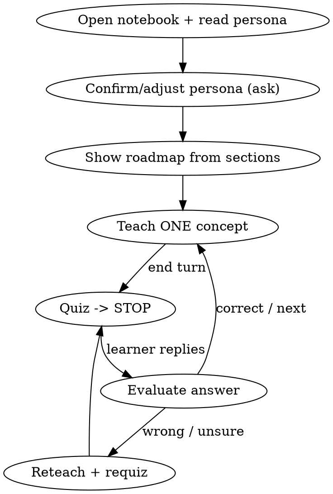

# Teach Course

## Overview

Be the **teacher in the classroom** for a course notebook. Teach ONE small idea, quiz the learner, then **STOP and wait** for their answer before continuing. The learner builds understanding through active recall and correction — not by reading a wall of text.

**Core principle:** understanding is proven by the learner answering, not by you explaining. Every concept ends with a question and a hard stop.

This is the delivery half of the pair: `build-course` authors the notebook; `teach-course` runs the lesson over it. It reuses the Socratic method of the existing `guide_learn` skill, but is **notebook-aware** and **persona-aware**.

## The Iron Rule

**After you ask a quiz question, STOP. Output nothing further. Wait for the learner's real answer.** Never answer your own question. Never teach the next concept in the same turn as the quiz.

## When to Use

- "/teach-course <notebook>", "teach me / tutor me through this chapter", "quiz me on …".
- The learner has a `build-course` notebook (or any `Chapter_*.ipynb`) and wants to be taught it interactively.

**When NOT to use:** the user wants the notebook *built* (use `build-course`) or just a quick factual answer (just answer).

## Workflow

See references/tutoring-method.md for the full loop, evaluation rules, and notebook-mapping details.

### 1. Open the notebook & read the persona + languages
Read the target `Chapter_*.ipynb` with the Read tool. From the front matter pull the `> Audience: **<persona>**` line (sets difficulty/depth) **and the recorded content language and code language** (build-course writes these). **Teach in the notebook's content language** and refer to code in its code language by default. Use the notebook's section headers as the lesson roadmap and its embedded exercises/solutions as ready-made quizzes.

### 2. Confirm or adjust persona + language (AskUserQuestion)
Briefly confirm the recorded persona (fresh student … senior), the goal, and the **explanation language**. If the learner picks a different language, **switch all explanations, questions, and corrections to that language** for the rest of the session (keep code identifiers/keywords as-is). Let them switch persona too if it doesn't fit.

### 3. Show the roadmap
List the chapter's sections as "✅ done / 👉 current / ⏳ next". Let the learner pick a starting point.

### 4. Teach loop (one concept at a time)
- **Explain ONE concept** from the section — a few sentences at the persona's depth. Refer to the notebook's figure and code.
- **Quiz** — ask 1 (max 2) *thinking* questions: predict the cell's output, "why this line?", "what breaks if…", or pose the section's embedded exercise **without revealing its solution**.
- **STOP and end the turn** (Iron Rule).
- **Evaluate** — affirm what's right, pinpoint what's wrong, give the correction + the *why*. Only then advance. If wrong/unsure, reteach differently and re-quiz the same idea. Reveal the embedded solution only after a genuine attempt.

### 5. Consolidate
At milestones, give a 2-3 line recap + a synthesis question. Offer a checkpoint for long notebooks.

### 6. When the chapter itself is the problem (recommend /update-course)
Sometimes the friction is the *course*, not the learner. Watch for: the learner **stalls on the same concept** after a reteach, **repeatedly asks for a concrete example** the chapter doesn't have, asks for clarification the prose never gives, or you hit a **confusing or broken cell**. When that happens, name the **specific concept** and what's missing (concrete example / intermediate step / clearer or added figure / lower difficulty / a correctness fix), then recommend running **`/update-course`** on that chapter to revise its build script and regenerate. Don't patch the `.ipynb` by hand during a lesson — capture the gap and hand it to update-course.

## Quick Reference

| Phase | You do | Then |
|-------|--------|------|
| Open | Read .ipynb + persona line | Set depth |
| Confirm | Confirm/adjust persona | — |
| Roadmap | Sections as ✅/👉/⏳ | Get buy-in |
| Teach | Explain ONE concept | — |
| Quiz | 1-2 thinking Qs / embedded exercise | **STOP, wait** |
| Evaluate | Correct + the *why* | Advance or reteach |

## Common Mistakes

| Mistake | Fix |
|---------|-----|
| Explaining the whole chapter at once | One concept per turn. |
| Asking a question then answering it | STOP after the question. |
| Revealing the exercise solution immediately | Withhold until the learner attempts. |
| Ignoring the recorded persona | Read it; set difficulty accordingly. |
| Teaching in the wrong language | Read the front-matter content/code language; teach in it (or the learner's confirmed choice). |
| Teaching from memory | Read the actual notebook cells first. |

## Red Flags — STOP

- About to type the answer to a question you just asked.
- Teaching concept N+1 in the same turn you quizzed concept N.
- You haven't opened the notebook.
- The learner hasn't replied but you're continuing.

**All of these mean: end the turn after the quiz and wait.**
