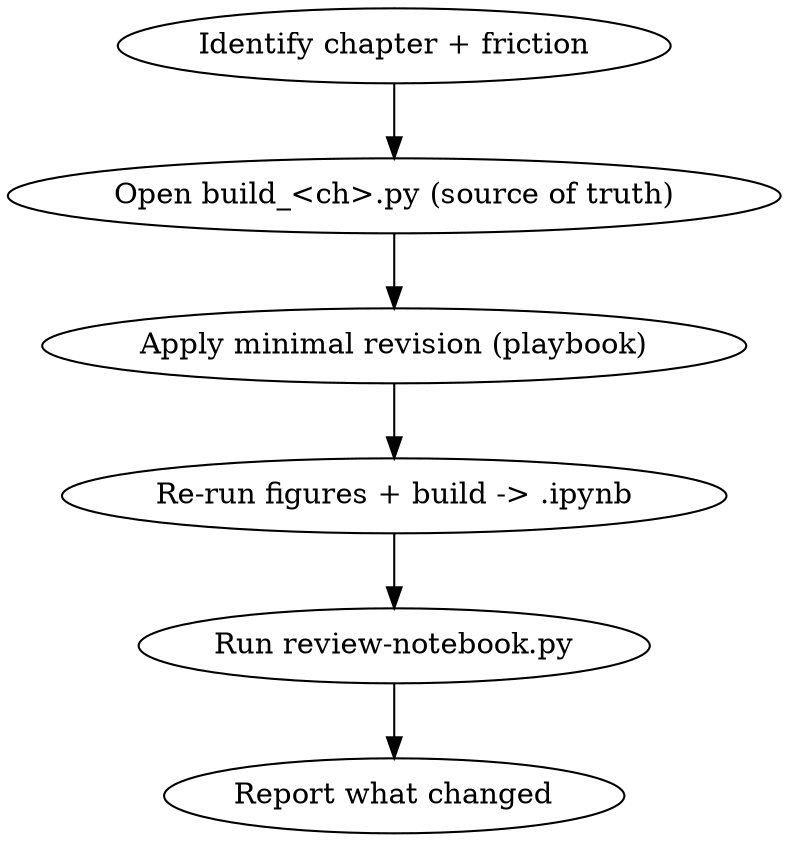

# Update Course

## Overview

Revise a chapter that isn't working — discovered while **teaching it** (teach-course) or from learner feedback — and regenerate it. The course is a living artifact: when a concept lands badly, you fix the *chapter*, not just re-explain it in the moment.

**Core principle (same as build-course):** the **build script is the source of truth**. Apply every change to `<course>/build_<ch>.py` (and `build_<ch>_figures.py`), then re-run to emit the `.ipynb`. **Never hand-edit the `.ipynb`** — the next rebuild would wipe it.

Companion to: `build-course` (authors chapters), `teach-course` (tutors through them and surfaces what to fix).

## When to Use

- A learner repeatedly stalls on the same concept, asks for a **concrete example the chapter lacks**, or asks for clarification the prose doesn't give.
- A cell is **wrong, confusing, or too dense**, or a difficulty spike loses the learner.
- `teach-course` recommended an update for a specific concept.

**When NOT to use:** authoring a brand-new chapter (use `build-course`); a one-off explanation the learner just needs *now* (answer it live, then decide if the chapter needs the fix too).

## Inputs (gather first)

1. **Which chapter** — the `Chapter_<ch>_*.ipynb` and its `build_<ch>.py`.
2. **The friction** — the specific concept, and what's missing: a concrete example / an intermediate step / a clearer or added figure / lower difficulty / a correctness fix. If invoked from teaching, capture this from the session.

## Workflow



1. **Locate the source.** Find `<course>/build_<ch>.py` (and `build_<ch>_figures.py`). If only the `.ipynb` exists, reconstruct the build script from it first — do not start hand-editing the notebook.
2. **Make the minimal revision** (playbook below). Preserve the front matter (persona, content language, code language) so the chapter stays consistent and `teach-course` keeps working. Keep changes scoped to the friction — don't refactor the whole chapter.
3. **Regenerate:** `python <course>/build_<ch>_figures.py` (if figures changed) then `python <course>/build_<ch>.py`.
4. **Re-review:** `python <course>/review-notebook.py <course>/Chapter_<ch>_*.ipynb`. Fix every ERROR; triage WARNs. (See build-course references/notebook-review.md.)
5. **Report** the concrete change and the reviewer result.

## Revision playbook (symptom → change)

| Symptom (from teaching/feedback) | Change to the build script |
|----------------------------------|----------------------------|
| "Too abstract / I don't get it" | Add a **concrete worked example** cell before the definition; add a predict-then-run demo. |
| Learner repeatedly asks for an example | Insert a runnable example (or a concept-simulation) for that exact concept. |
| Difficulty spike — one cell jumps too far | Split into **intermediate steps**; add a bridging cell between them. |
| Wall-of-text cell (reviewer WARNs >1800 chars) | Split along the concept arc: motivate → define → figure → gap → runnable → interpret. |
| The diagram doesn't land | Add or improve a **Mermaid** diagram (Mermaid-first; see notebook-blueprint.md). |
| Exercise too hard / too easy | Re-tune to the persona; add a stub or a hint; adjust the asserts. |
| A claim is wrong or uncited | Correct it and **cite the source** (book section / repo `path:line`). |
| A query/DSL was paraphrased in Python | Restore the specialized language **verbatim** (```sql / ```cypher), keep generic code only for mapping. |
| An embedded video has a visual bug (overlap, a box not covering its text) or "doesn't flow" | Edit the scene `.py` (the video's source of truth — like the build script), re-render, re-embed. See build-course references/interactive-visualization.md (overlap-safe layout, no-LaTeX `Text`, persistent-anchor flow, smoke-then-final render). |
| Cell errors out | Fix the code; the reviewer must pass. |

## Common Mistakes

| Mistake | Fix |
|---------|-----|
| Hand-editing the `.ipynb` | Edit `build_<ch>.py` and re-run; the script is the source of truth. |
| Rewriting the whole chapter for one rough spot | Keep the revision minimal and scoped to the friction. |
| Dropping/altering the front-matter persona or languages | Preserve them so the chapter and teach-course stay consistent. |
| Regenerating but not re-running the reviewer | Always re-run `review-notebook.py` after a rebuild. |

## Red Flags — STOP

- About to edit the `.ipynb` directly → edit the build script instead.
- Changing difficulty/examples without knowing the **specific** concept that failed → pin down the friction first.
- Shipping the revised chapter without re-running the reviewer.
